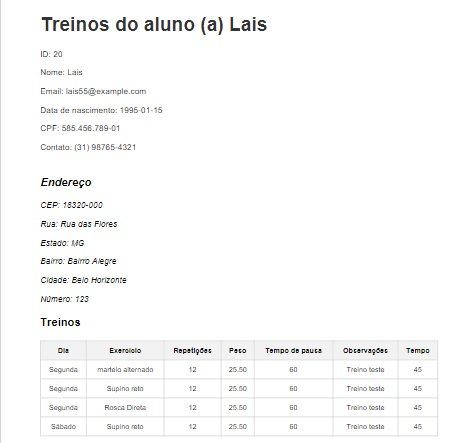

# Academia API

## Descrição
Esta é uma aplicação API Rest construída com Laravel 10, utilizando PostgreSQL como banco de dados. A aplicação simula o sistema de uma academia.

## Tecnologias Utilizadas
- [Laravel](https://laravel.com/) - Framework PHP
- [PostgreSQL](https://www.postgresql.org/) - Banco de Dados Relacional
- [Mailtrap](https://mailtrap.io/) - Serviço de Teste de Email
- [DomPDF](https://github.com/barryvdh/laravel-dompdf) - Geração de PDF

## Meios de Preparo para o Ambiente

Antes de começar, certifique-se de ter o [Composer](https://getcomposer.org/) instalado em sua máquina.

### Clonando o Projeto
```bash
git clone https://github.com/lcsrlm/projeto-avaliativo-modulo-2.git
cd projeto-avaliativo-modulo-2
```

### Instalando as Dependências
```bash
composer install
```

### Configurando o Arquivo .env
Crie uma cópia do arquivo .env.example e renomeie para .env. Abra o arquivo .env e configure as variáveis de ambiente, incluindo as informações do banco de dados.

```bash
DB_CONNECTION=pgsql
DB_HOST=127.0.0.1
DB_PORT=5432
DB_DATABASE=academia_api
DB_USERNAME=admin
DB_PASSWORD=admin
```

### Iniciando o Banco de Dados
```bash
php artisan migrate
```

### Iniciando o servidor 
```bash
php artisan serve
```

## Rotas

### Autenticação
- **POST /login**: Realiza o login.
  - **Exemplo de Requisição:**
    ```json
    {
      "email": "lucasdarosa@email.com",
      "password": "senha123@"
    }
    ```
  - **Status 201 - Sucesso:**
    ```json
    {
      "message": "Autorizado",
      "token": "29|sxQtb4xTtMY9t2rC1zOBGtXNbAMQdLDKJruxkntm5385ae8a"
    }
    ```
  - **Status 401 - Não autorizado:**
    ```json
    {
      "message": "Não autorizado. Credenciais inválidas",
      "status": 401,
      "errors": [],
      "data": []
    }
    ```

### Usuários
- **POST /users**: Cadastra um novo usuário.
  - **Exemplo de Requisição:**
    ```json
    {
      "name": "Lucas da Rosa",
      "email": "lucasdarosa@email.com",
      "date_birth": "1996-09-14",
      "cpf": "542.806.738-31",
      "password": "senha123@",
      "plan_id": 1
    }
    ```
  - **Status 201 - Sucesso:**
    ```json
    {
      "message": "Usuário cadastrado com sucesso.",
      "status": 201,
      "data": {
        "name": "Lucas da Rosa",
        "email": "lucasdarosa@email.com",
        "date_birth": "1996-09-14",
        "cpf": "542.806.738-31",
        "plan_id": 1,
        "updated_at": "2023-12-30T16:43:46.000000Z",
        "created_at": "2023-12-30T16:43:46.000000Z",
        "id": 25,
        "plan": {
          "id": 1,
          "description": "BRONZE",
          "limit": 10,
          "created_at": "2023-12-13T01:06:16.000000Z",
          "updated_at": "2023-12-13T01:06:16.000000Z"
        }
      }
    }
    ```
  - **Status 400 - Email já cadastrado:**
    ```json
    {
      "message": "The email has already been taken.",
      "status": 400,
      "errors": [],
      "data": []
    }
    ```
  - **Status 400 - CPF já cadastrado:**
    ```json
    {
      "message": "The cpf has already been taken.",
      "status": 400,
      "errors": [],
      "data": []
    }
    ```

### Dashboard
- **GET /dashboard**: Retorna dados do usuário logado.
  - **Exemplo de Requisição:**
    - Requer autenticação.
  - **Status 200 - Sucesso:**
    ```json
    {
      "registered_students": 10,
      "registered_exercises": 10,
      "current_user_plan": "BRONZE",
      "remaining_studants": 0
    }
    ```

### Exercícios
- **GET /exercises**: Retorna todos os exercícios cadastrados.
  - **Exemplo de Requisição:**
    - Requer autenticação.
  - **Status 200 - Sucesso:**
    ```json
    {
      "id": 27,
      "description": "Flexão de Braço",
      "user_id": 24,
      "created_at": "2023-12-28T22:22:26.000000Z",
      "updated_at": "2023-12-28T22:22:26.000000Z"
    }
    ```
- **POST /exercises**: Cadastra um novo exercício.
  - **Exemplo de Requisição:**
    ```json
    {
      "description": "Flexão de Braço"
    }
    ```
  - **Status 201 - Created:**
    ```json
    {
      "description": "Flexão de Braço"
    }
    ```
  - **Status 409 - Conflito:**
    ```json
    {
      "error": "Exercício já cadastrado para o mesmo usuário."
    }
    ```
- **DELETE /exercises/{id}**: Deleta um exercício com base no ID.
  - **Exemplo de Rota:**
    `http://127.0.0.1:8000/api/exercises/21`
  - **Status 204 - Sucesso**

### Alunos
- **GET /students**: Retorna todos os alunos cadastrados, com opção de filtros.
  - **Exemplo de Requisição:**
    - Requer autenticação.
  - **Status 200 - Sucesso:**
    ```json
    {
      "id": 20,
      "name": "lais",
      "email": "lais525@example.com",
      "date_birth": "1995-01-15",
      "cpf": "544.456.789-01",
      "contact": "(31) 98765-4321",
      "user_id": 24,
      "city": "Belo Horizonte",
      "neighborhood": "Bairro Alegre",
      "number": "123",
      "street": "Rua das Flores",
      "state": "MG",
      "cep": "18320-000",
      "created_at": "2023-12-28T22:07:56.000000Z",
      "updated_at": "2023-12-30T17:09:26.000000Z",
      "deleted_at": null
    }
    ```
- **GET /students/{id}**: Retorna informações de um aluno específico.
  - **Exemplo de Rota:**
    `http://127.0.0.1:8000/api/students/23`
  - **Status 200 - Sucesso:**
    ```json
    {
      "id": 20,
      "name": "lais",
      "email": "lais525@example.com",
      "date_birth": "1995-01-15",
      "cpf": "544.456.789-01",
      "contact": "(31) 98765-4321",
      "address": {
        "cep": "18320-000",
        "street": "Rua das Flores",
        "state": "MG",
        "neighborhood": "Bairro Alegre",
        "city": "Belo Horizonte",
        "number": "123"
      }
    }
    ```
- **POST /students**: Cadastra um novo aluno.
  - **Exemplo de Requisição:**
    ```json
    {
      "name": "Gabriela Lima",
      "email": "gabilima@example.com",
      "date_birth": "1995-01-15",
      "cpf": "643.456.789-01",
      "contact": "(31) 98765-4321",
      "cep": "12345-678",
      "street": "Rua das Flores",
      "state": "MG",
      "neighborhood": "Bairro Alegre",
      "city": "Belo Horizonte",
      "number": "123"
    }
    ```
  - **Status 201 - Created**
  - **Status 400 - Bad Request:**
    ```json
    {
      "error": "Dados já cadastrados"
    }
    ```
  - **Status 403 - Forbidden (Limite de cadastros):**
    ```json
    {
      "error": "Limite de cadastro de estudantes atingido."
    }
    ```
- **PUT /students/{id}**: Atualiza dados de um aluno.
  - **Exemplo de Rota:**
    `http://127.0.0.1:8000/api/students/20`
  - **Exemplo de Requisição:**
    ```json
    {
      "name": "lais",
      "email": "lais525@example.com",
      "date_birth": "1995-01-15",
      "cpf": "544.456.789-01",
      "contact": "(31) 98765-4321",
      "cep": "18320-000",
      "street": "Rua das Flores",
      "state": "MG",
      "neighborhood": "Bairro Alegre",
      "city": "Belo Horizonte",
      "number": "123"
    }
    ```
  - **Status 200 - OK:**
    ```json
    {
      "id": 20,
      "name": "lais",
      "email": "lais525@example.com",
      "date_birth": "1995-01-15",
      "cpf": "544.456.789-01",
      "contact": "(31) 98765-4321",
      "user_id": 24,
      "city": "Belo Horizonte",
      "neighborhood": "Bairro Alegre",
      "number": "123",
      "street": "Rua das Flores",
      "state": "MG",
      "cep": "18320-000",
      "created_at": "2023-12-28T22:07:56.000000Z",
      "updated_at": "2023-12-30T17:09:26.000000Z",
      "deleted_at": null
    }
    ```
  - **Status 500:**
    ```json
    {
      "error": "Erro no servidor ao processar a requisição."
    }
    ```
- **DELETE /students/{id}**: Deleta um aluno.
  - **Exemplo de Rota:**
    `http://127.0.0.1:8000/api/students/26`
  - **Status 204 - No content**
  - **Status 404 - Not found:**
    ```json
    {
      "error": "Estudante não encontrado."
    }
    ```

### Treinos
- **POST /workouts**: Cadastra um novo treino para um aluno.
  - **Exemplo de Requisição:**
    ```json
    {
      "student_id": 20,
      "exercise_id": 16,
      "repetitions": 12,
      "weight": 25.5,
      "break_time": 60,
      "day": "SÁBADO",
      "observations": "Treino teste",
      "time": 45
    }
    ```
  - **Status 201 - Created:**
    ```json
    {
      "student_id": 20,
      "exercise_id": 16,
      "repetitions": 12,
      "weight": 25.5,
      "break_time": 60,
      "day": "SÁBADO",
      "observations": "Treino teste",
      "time": 45,
      "updated_at": "2023-12-30T17:19:45.000000Z",
      "created_at": "2023-12-30T17:19:45.000000Z",
      "id": 13
    }
    ```
  - **Status 409 - Conflict:**
    ```json
    {
        "error": "Já existe um treino cadastrado para o mesmo aluno, exercício e dia"
    }    
    ```
    - **GET /workouts/ (Para acessar essa rota o usuário precisa estar autenticado)**
  - Exemplo de rota: http://127.0.0.1:8000/api/students/20/workouts
  - Status 200 (Sucesso)
    ```json
    {
      "student_id": "20",
      "student_name": "lais",
      "workouts": {
        "SEGUNDA": [],
        "TERÇA": [],
        "QUARTA": [],
        "QUINTA": [],
        "SEXTA": [],
        "SÁBADO": [
          {
            "id": 13,
            "student_id": 20,
            "exercise_id": 16,
            "description": "Supino reto",
            "repetitions": 12,
            "weight": "25.50",
            "break_time": 60,
            "day": "SÁBADO",
            "observations": "Treino teste",
            "time": 45,
            "created_at": "2023-12-30 17:19:45",
            "updated_at": "2023-12-30 17:19:45"
          }
        ],
        "DOMINGO": []
      }
    }
    ```

### Relatórios
- **GET /students/{id}/export (Para acessar essa rota o usuário precisa estar autenticado)**
  - Exemplo de rota: http://127.0.0.1:8000/api/students/23/export
  - Status 200 (Sucesso)
  - Gera o arquivo PDF com os dados do aluno para download.
  
  


### Logout
- **POST /logout**: Realiza o logout, invalidando o token de autenticação.
  - **Exemplo de Requisição:**
    ```json
    {
      "token": "29|sxQtb4xTtMY9t2rC1zOBGtXNbAMQdLDKJruxkntm5385ae8a"
    }
    ```
  - **Status 200 - Sucesso:**
    ```json
    {
      "message": "Logout realizado com sucesso."
    }
    ```

### Contato
- Para dúvidas ou problemas, entre em contato.
- Conecte-se comigo:
  - [GitHub](https://github.com/lcsrlm)
  - [LinkedIn](https://www.linkedin.com/in/lucas-da-rosa-lima-82b244182?utm_source=share&utm_campaign=share_via&utm_content=profile&utm_medium=android_app)


### Considerações Finais
- Esta API oferece funcionalidades essenciais para o gerenciamento de uma academia, incluindo autenticação, cadastro de usuários, exercícios, alunos, treinos e geração de relatórios em PDF.
- Certifique-se de fornecer o token de autenticação válido nas rotas que exigem autenticação.
- Obrigado por utilizar a Academia API!
